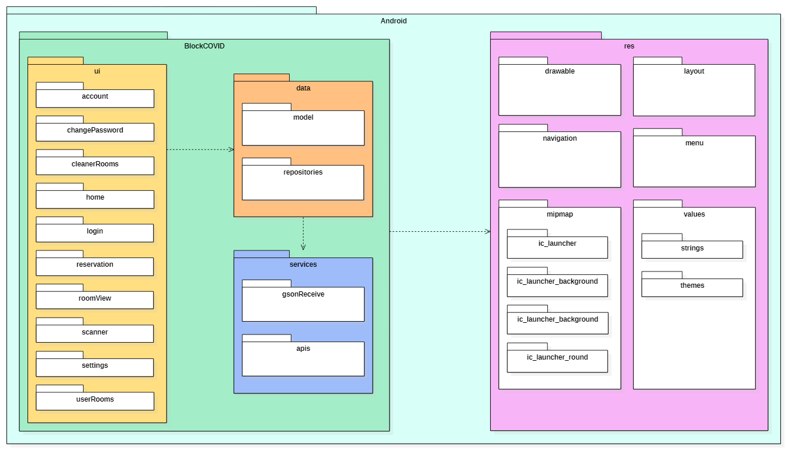

# Manuale sviluppatore Android
## Introduzione
Lo scopo del Manuale per lo sviluppatore è presentare l’architettura del prodotto BlockCovid, l’organizzazione del codice sorgente e tutte le informazioni relative al mantenimento ed estensione del progetto.
Questo documento ha il fine di illustrare le procedure di installazione e sviluppo, illustrare i framework e le librerie utilizzate, facendo uso di diagrammi UML dei package, classe e di sequenza.

## Scopo del Documento
Il prodotto che si vuole sviluppare è BlockCOVID, un' applicazione web e mobile mirata a gestire al meglio la situazione pandemica all’interno di aziende ed aule studio. L’applicazione include al suo interno tre tipi di utenti che utilizzeranno il software, con le loro relative esigenze:

1. amministratore: gestisce le stanze ed ha accesso ai report giornalieri e in tempo reale;
2. dipendente: riceve informazioni utili sulla postazione di lavoro che può prenotare ed igienizzare con un eventuale kit fornito in loco;
3. addetto alle pulizie: conosce lo stato di pulizia di ogni stanza per ottimizzare il suo operato.

L’applicazione è quindi divisa in 3 parti:

1. Back-End server: gestisce le REST API,l'uso della blockchain e l'implementazione di Docker;
2. Front-End Web: gestisce un applicativo web utilizzato esclusivamente dall’amministra-tore per gestire i dati di stanze, prenotazioni ed account;
3. Applicazione Android: gestisce un’applicazione mobile che sarà utilizzata da tutti gliutenti per prenotare, visualizzare e gestire le postazioni.

## Note esplicative

Per evitare disinformazioni e ambiguità, soprattutto riguardo il linguaggio utilizzato nei do-cumenti formali, viene fornito il Glossario, nel quale vi sono definizioni precise e descrizioni specifiche di tutti termini. Le parole inserite in tale documento saranno contrassegnate da una ’G’ a pedice in stile corsivo.

## Riferimenti
### Riferimenti normativi
### Riferimenti informativi

# Tecnologie e Librerie Utilizzate
## Tecnologie
### Android SDK 30
Android SDK fornisce le librerie API e gli strumenti per sviluppatori necessari per creare, testare ed eseguire il debug di app per Android.

https://developer.android.com/studio/

### Kotlin 1.4.32

Kotlin è un linguaggio di programmazione general purpose, multi-paradigma, open source sviluppato dall’azienda di software JetBrains. Kotlin si basa sulla JVM (Java Virtual Machine) e dal 2019 viene utilizzato da Google per lo sviluppo Android.
https://kotlinlang.org/

### Gradle 6.5
Gradle è uno strumento di automazione della build open source progettato per essere abbastanza flessibile da creare quasi tutti i tipi di software. Gradle viene eseguito sulla JVM e per utilizzarlo è necessario disporre di un Java Development Kit (JDK)
https://docs.gradle.org/current/userguide/userguide.html

### Java SDK 8
JDK è un ambiente di sviluppo per la creazione di applicazioni utilizzando il linguaggio diprogrammazione Java. Include strumenti utili per lo sviluppo e il test di programmi scritti nel linguaggio di programmazione Java e in esecuzione sulla piattaforma JavaTM.
https://www.oracle.com/it/java/technologies/javase/javase8-archive-downloads.html
## Librerie
### AndroidX
AndroidX è un importante miglioramento rispetto alla libreria di supporto Android originale,che non viene più mantenuta. I pacchetti androidx sostituiscono completamente la libreria di supporto fornendo parità di funzionalità e nuove librerie. Gli artifact all’interno del namespac eandroidx comprendono le librerie Jetpack di Android. Come la libreria di supporto, le librerie del namespace androidx vengono fornite separatamente dalla piattaforma Android e forniscono la compatibilità con le versioni precedenti tra le versioni di Android
https://developer.android.com/jetpack/androidx/
### Okhttp3
OkHttp è un client HTTP spesso utilizzato assieme alla libreria Retrofit2.
https://square.github.io/okhttp/
### Retrofit2
Retrofit trasforma l’API HTTP in un’interfaccia Java. Questa libreria è stata utilizzata pergestire le numerose chiamata API necessarie per sviluppare le funzionalità richieste da capitolato.
https://square.github.io/retrofit/
### Material Design
Material è un sistema di progettazione, supportato da codice open source, che aiuta i team acreare esperienze digitali di alta qualità. Tramite questa libreria abbiamo creato i componentidi design della nostra App.
https://material.io/
### Junit
JUnit è un semplice framework per scrivere test ripetibili. È un’istanza dell’architettura xUnit per framework di unit test. Nella nostra applicazione mobile Junit è stato utilizzato assieme a Mockito per sviluppare i test di unità.
https://junit.org/junit4/
### Mockito
Mockito è un mocking framework per sviluppare test in Java, lo abbiamo utilizzato per scrivere i nostri test di unità.
https://site.mockito.org/
### ZoomLayout
ZoomLayout è una raccolta di componenti Android che supportano lo zoom e la panoramica digerarchie di visualizzazione, immagini, flussi video e molto altro.
https://natario1.github.io/ZoomLayout/home
### Espresso
Espresso è una libreria nata per scrivere test dell’interfaccia utente Android.  Espresso testa chiaramente le aspettative, le interazioni e le affermazioni senza che la distrazione di contenuti standard, infrastrutture personalizzate o dettagli di implementazione disordinati si intromettano. Nella nostra applicazione questa libreria è stata utlizzata per creare un test dell’interfaccia utente.
https://developer.android.com/training/testing/espresso/
### Jacoco
Il plug-in JaCoCo fornisce metriche di copertura del codice per il codice Java tramite l’integrazione con JaCoCo.
https://www.jacoco.org/jacoco/

# Setup
## Requisiti minimi di sistema
### Prerequisiti
1. Android Studio
2. (opzionale)Dispositivo Android

### Requisiti Hardware

1. 4GB di memoria RAM
2. Sistema operativo 64bit

## Installazione
Per preparare l’ambiente di lavoro per lo sviluppo dell’applicazione mobile BlockCOVID è necessario:
1. scaricare ed installare Android Studio, disponibile al seguente link: https://developer.android.com/studio;
2. scaricare l’ultima release dell’applicazione, in formato .zip, disponibile al seguente link: https://github.com/SwevenSoftware/BlockCOVID-android/releases;
3. estrarne il contenuto in una cartella qualsiasi;
4. tramite Android Studio, aprire la cartella in cui è stata estratta la release come progetto;
Se si desidera inoltre installare l’applicazione sul proprio dispositivo Android è necessario:
1. Attivare la modalità debug sul proprio dispositivo Android;
2. fare la build del progetto tramite Android Studio andando su Build > Make Project o lashortcut Ctrl + F9;
3. collegare il proprio dispositivo Android al computer, autorizzando la lettura/scrittura difile;
4. aprire la tendina "Available devices" in alto a destra di Android Studio e selezionare ilproprio dispositivo;
5. fare il run del progetto tramite Android Studio andando su Run > Run ’app’ o la shortcutCtrl + F10.

Se non si disponesse di un dispositivo Android fisico è possibile utilizzare l’emulatore fornito da Android Studio. Per utilizzarlo è sufficiente selezionare il dispositivo emulato, invece che quello fisico,  dalla tendina "Available devices". Il resto dei passi per l’installazione rimangono gli stessi.

# Test
## Test Unità
I test di unità sono stati sviluppati utilizzando Junit e Mockito.
Per eseguirli è sufficiente fare tasto destro sul file di test e cliccare su "Run Test", il compilatore di Android Studio si occuperà del resto.
## Test Interfaccia
I test di interfaccia invece sono stati sviluppati tramite Espresso.
Per eseguirli è necessario prima fare il run sul dispositivo mobile o sulla macchina virtuale, e poi fare "Run test" sul file di test.

## GitHub Actions
Il servizio di Continuous IntegrationG che è stato deciso di utilizzare è GitHub Actions, fornito appunto da GitHub. Questo permette di creare dei workflow personalizzati, ovvero dei processi automatici creati sulla base delle proprie esigenze. Ciò ha l’obiettivo di automatizzare il ciclo di vita di sviluppo del software grazie ad un ampia gamma di strumenti e servizi.
# Architettura del prodotto
L'architettura scelta per l'applicazione mobile è il MVVM (Model view viewmodel).
Questa architetura è ottima per separare logica da presentazione, ma non solo, è particolarmente utile per gestire con efficacia e scalabilità le chiamate API.
Ogni funzionalità infatti segue questa architettura, con alcune aggiunte per soddisfare le necessità intrinseche ad ogni funzionalità.

Questo si denota dal nostro diagramma dei package:

Il package UI gestiscono i file della view, mentre il package data gestisce il model e il package services contiene i file del viewModel.
Invece il package Res contiene tutti i file xml e bipmap per gestire l'aspetto e le icone dell'applicazione.

Nello specifico quindi ogni funzionalità ricrea il MVVM, come descritto in questo diagramma delle classi, specifico per la funzionalità UserRooms:

Da questo diagramma possiamo vedere come sono implementati i metodi ed i file del MVVM.
Per prima cosa viene creato il model, per gestire gli oggetti in entrata dal lato server.
La chiamata Get all'API viene fatta dall'interfaccia APIRooms, creata dalla UserRepository tramite il nostro Retrofit Builder, implementato nel file NetworkClient.
In NetworkCLient vengono anche gestiti i certificati http tramite la librria Okhttp3.
L'userRoomsFragment gestisce assieme ai file XML la view, e alla creazione di sè stesso tramite un UserRoomsViewModelFactory crea il nostro viewModel, UserRoomsViewModel.
I dati che ci vengono passati dal lato server, tramite Retrofit ed il Model sono dati LiveData, i quali vengono gestiti da UserRoomsRepository e UserRoomsViewModel tramite observers definiti nei file.
Questi observers si occupano di gestire e notificare alla view i cambiamenti agli oggetti, in modo da poter aggiornare i dati visti dall'utente nell'applicazione.

Come introdotto prima, ogni funzionalità ha dei bisogni aggiuntivi propri, in questo caso ad esempio è stato necessario implementare un UserRoomsAdapter per gestire dinamicamente gli oggetti della lista prenotazioni, implementata tramite uno standard RecyclerView.

